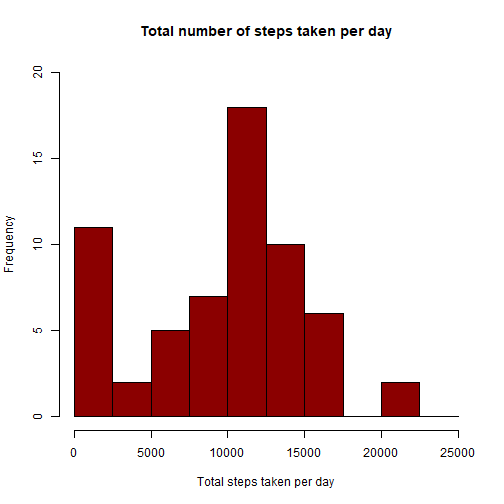
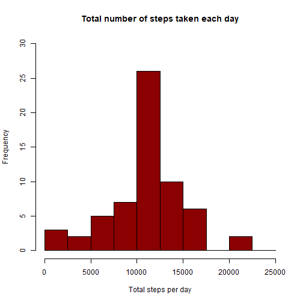
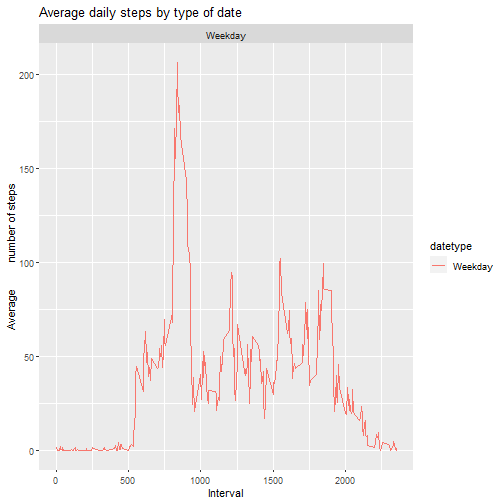

#My submission
===============

##Setting global option to turn warnings off

```r
knitr::opts_chunk$set(warning=FALSE)
```
 
##Loading and processing the data:


```r
library(ggplot2)
activity <- read.csv("activity.csv")
activity$date <- as.POSIXct(activity$date, "GMT")
weekday <- weekdays(activity$date)
activity <- cbind(activity,weekday)
summary(activity)
```

```
##      steps             date               interval        weekday         
##  Min.   :  0.00   Min.   :2012-10-01   Min.   :   0.0   Length:17568      
##  1st Qu.:  0.00   1st Qu.:2012-10-16   1st Qu.: 588.8   Class :character  
##  Median :  0.00   Median :2012-10-31   Median :1177.5   Mode  :character  
##  Mean   : 37.38   Mean   :2012-10-31   Mean   :1177.5                     
##  3rd Qu.: 12.00   3rd Qu.:2012-11-15   3rd Qu.:1766.2                     
##  Max.   :806.00   Max.   :2012-11-30   Max.   :2355.0                     
##  NA's   :2304
```

#1.Mean total number of steps taken per day :


```r
activity_total_steps <- with(activity, aggregate(steps, by = list(date), FUN = sum, na.rm = TRUE))
names(activity_total_steps) <- c("date", "steps")

hist(activity_total_steps$steps, main = "Total number of steps taken per day", xlab = "Total steps taken per day", col = "darkred", ylim = c(0,20), breaks = seq(0,25000, by=2500))
```



The mean of the total number of steps taken per day:

```r
mean(activity_total_steps$steps)
```

```
## [1] 9354.23
```

The median of the total number of steps taken per day:

```r
median(activity_total_steps$steps)
```

```
## [1] 10395
```


#2.The average daily activity pattern:

.Making a time series plot (i.e. \color{red}{\verb|type = "l"|}type = "l") of the 5-minute interval (x-axis) and the average number of steps taken, averaged across all days (y-axis):

```r
average_daily_activity <- aggregate(activity$steps, by=list(activity$interval), FUN=mean, na.rm=TRUE)
names(average_daily_activity) <- c("interval", "mean")
plot(average_daily_activity$interval, average_daily_activity$mean, type = "l", col="darkblue", lwd = 2, xlab="Interval", ylab="Average number of steps", main="Average number of steps per intervals")
```


.Which 5-minute interval, on average across all the days in the dataset, contains the maximum number of steps?

```r
average_daily_activity[which.max(average_daily_activity$mean), ]$interval
```

```
## [1] 835
```

#3.Imputing missing values:

.Calculate and report the total number of missing values in the dataset (i.e. the total number of rows with NAs):

```r
sum(is.na(activity$steps))
```

```
## [1] 2304
```

.Filling in all of the missing values in the dataset:

```r
imputed_steps <- average_daily_activity$mean[match(activity$interval, average_daily_activity$interval)]
```

.Create a new dataset that is equal to the original dataset but with the missing data filled in.

```r
activity_imputed <- transform(activity, steps = ifelse(is.na(activity$steps), yes = imputed_steps, no = activity$steps))
total_steps_imputed <- aggregate(steps ~ date, activity_imputed, sum)
names(total_steps_imputed) <- c("date", "daily_steps")
```

.Make a histogram of the total number of steps taken each day and Calculate and report the mean and median total number of steps taken per day. Do these values differ from the estimates from the first part of the assignment? What is the impact of imputing missing data on the estimates of the total daily number of steps?

```r
hist(total_steps_imputed$daily_steps, col = "darkred", xlab = "Total steps per day", ylim = c(0,30), main = "Total number of steps taken each day", breaks = seq(0,25000,by=2500))
```



.The mean of the total number of steps taken per day:

```r
mean(total_steps_imputed$daily_steps)
```

```
## [1] 10766.19
```

.The median of the total number of steps taken per day:

```r
median(total_steps_imputed$daily_steps)
```

```
## [1] 10766.19
```

#4.Are there differences in activity patterns between weekdays and weekends?

.Creating a new factor variable in the dataset with two levels – “weekday” and “weekend” indicating whether a given date is a weekday or weekend day.

```r
activity$date <- as.Date(strptime(activity$date, format="%Y-%m-%d"))
activity$datetype <- sapply(activity$date, function(x) {
        if (weekdays(x) == "Sábado" | weekdays(x) =="Domingo") 
                {y <- "Weekend"} else 
                {y <- "Weekday"}
                y
        })
```

.Making a panel plot containing a time series plot (i.e. type = “l”) of the 5-minute interval (x-axis) and the average number of steps taken, averaged across all weekday days or weekend days (y-axis).

```r
activity_by_date <- aggregate(steps~interval + datetype, activity, mean, na.rm = TRUE)
plot<- ggplot(activity_by_date, aes(x = interval , y = steps, color = datetype)) +
       geom_line() +
       labs(title = "Average daily steps by type of date", x = "Interval", y = "Average         number of steps") +
       facet_wrap(~datetype, ncol = 1, nrow=2)
print(plot)
```


